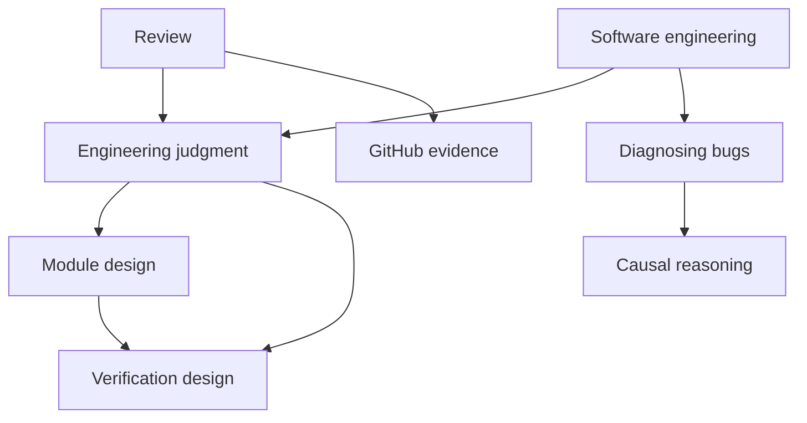

# Personal skill library

Delegate a whole job or use a supporting judgment on its own. Each skill owns a
useful result behind one `SKILL.md` interface. Its references carry the methods,
examples and constraints that the caller should not have to reconstruct.

**Core skills** reason over supplied material and return an assessment,
transformation or design. **Workflows** own acquisition, feedback, execution and
the combined outcome. A platform skill can supply a bounded operational capability
inside a larger workflow. Both kinds of skill can be deep; a larger skill earns
its depth by taking responsibility for how its supporting results fit together.

## Delegate a job

| Job | Skill | Responsibility it takes over |
| --- | --- | --- |
| Implement a selected change | [software-engineering](software-engineering/SKILL.md) | Repository investigation, relevant design judgments, edits and verification; selected TDD, finishing and lint enforcement |
| Review a change | [review](review/SKILL.md) | Current target, evidence acquisition, falsification and one integrated judgment |
| Diagnose a failure | [diagnosing-bugs](diagnosing-bugs/SKILL.md) | Reproduction, discriminating probes and supported cause; correction when authorized |
| Find architectural opportunities | [architecture-scan](architecture-scan/SKILL.md) | Read-only coverage and ranked ownership moves; explicit selection only |
| Specify a selected change | [tech-spec](tech-spec/SKILL.md) | Source acquisition, decision resolution and a typed contract-and-flow handoff; explicit selection only |
| Work through a plan's open decisions | [grilling](grilling/SKILL.md) | Dependency-ready question rounds and confirmed shared understanding |
| Preserve intent through changing work | [steward](steward/SKILL.md) | Durable Intent, State, Record, coordination and evidence for acceptance |
| Learn through a prototype | [prototype](prototype/SKILL.md) | A runnable experiment, actual observations and their limits |
| Explain a relationship visually | [show-me](show-me/SKILL.md) | Source grounding, representation, artifact construction and inspection |
| Operate an Augment workflow | [augment-workflows](augment-workflows/SKILL.md) | Current product contracts, graph design, authorized operations and observed outcomes |
| Acquire GitHub evidence | [github](github/SKILL.md) | Complete PR/thread/CI observations and precise platform action receipts |
| Acquire Grafana evidence | [grafana](grafana/SKILL.md) | Bounded telemetry, population comparisons, reproducible queries and coverage limits |

A supporting workflow returns to its caller. For example, diagnosis can investigate
an unexpected failure during implementation without taking over the implementation
or changing its scope.

## Use a judgment or transformation

These 22 core skills accept relevant context, apply their methods and return work
the caller can use. Missing evidence produces a precise need with the conclusion
it affects. The surrounding task or workflow obtains that evidence and continues.

| Need | Skill | Result |
| --- | --- | --- |
| Interpret Daniel's intent and tradeoffs | [good-judgment](good-judgment/SKILL.md) | The distinction that matters and a next move grounded in the current purpose, decisions and evidence |
| Understand what differs | [understand-change](understand-change/SKILL.md) | Behavior and responsibility map with evidence and gaps |
| Assess code or contracts | [engineering-judgment](engineering-judgment/SKILL.md) | Applicable engineering obligations or supported weaknesses |
| Decide what would prove behavior | [verification-design](verification-design/SKILL.md) | Observation seams, independent oracles and required implementation evidence; assessment of supplied proof |
| Design an interface or ownership boundary | [module-design](module-design/SKILL.md) | Hidden responsibilities, concrete usage and tradeoffs |
| Assess an upgrade | [dependency-compatibility](dependency-compatibility/SKILL.md) | Usage, upstream and runtime impact, migration needs and proof gaps |
| Reason from diagnostic observations | [causal-reasoning](causal-reasoning/SKILL.md) | Reproduction adequacy, hypotheses, discriminating probe or supported cause |
| Design a useful experiment | [experiment-design](experiment-design/SKILL.md) | The smallest distinguishing experiment, or learning from its actual results |
| Sharpen domain meaning | [domain-modeling](domain-modeling/SKILL.md) | Terms, invariants, counterexamples and proposed glossary/ADR deltas |
| Assess an addition's continuing cost | [engineering-restraint](engineering-restraint/SKILL.md) | Necessity, alternatives, ownership burden and recommendation |
| Settle whether an objection may block | [decision-rights](decision-rights/SKILL.md) | Supported next action and settlement |
| Falsify a candidate | [critique](critique/SKILL.md) | Findings against supplied purpose, constraints and evidence |
| Help someone judge work | [reviewability](reviewability/SKILL.md) | A faithful PR description, review guide or other account |
| Design a human experience | [interface-design](interface-design/SKILL.md) | Coherent interaction, composition, state and motion; assessment of supplied renders |
| Apply Augment identity | [augment-design](augment-design/SKILL.md) | Official resources, brand application and required surface evidence |
| Derive an AI work product faithfully | [faithful-derivation](faithful-derivation/SKILL.md) | An integrated design or assessment of judgments, fidelity, support, publication policy and evals |
| Decide what information must survive | [information-preservation](information-preservation/SKILL.md) | Consumer-specific fidelity contract or loss assessment |
| Assess what evidence supports | [claim-support](claim-support/SKILL.md) | Provenance, contradictions, uncertainty and justified claim strength |
| Design AI quality measurement | [evaluation-design](evaluation-design/SKILL.md) | Representative cases, oracles, layer checks, comparisons and ablations |
| Write instructions for an agent | [writing-for-agents](writing-for-agents/SKILL.md) | Reachable, well-structured instructions with clear behavioral demands |
| Restore human voice | [humanize](humanize/SKILL.md) | Proposed prose that preserves meaning, uncertainty and the intended speaker |
| Generate or shape ideas | [creative-ideation](creative-ideation/SKILL.md) | A selected method and concrete directions, transformations or exercise proposals |

Core skills can themselves be deep compositions. Faithful derivation connects
preservation, support and evaluation into a coherent work-product design; its
caller need not assemble those relationships.

## How work composes

A review can use the same engineering and verification judgments as implementation.
Each caller owns a different outcome and the operations needed to establish it.



These are conditional dependencies, not a sequence every task must execute.
A core's inputs and results use the domain's natural form. A workflow resolves
missing context, integrates conflicting assessments and supplies new observations
when they change a conclusion. Skill composition does not itself require agents,
a scheduler or a serialized result protocol.

For a direct request such as “humanize this file,” the surrounding task reads the
file, supplies the prose to humanize, applies the authorized replacement and checks
the stored result. The user does not have to assemble a packet or select a generic
read/write wrapper. For a supplied-only assessment, the core returns its result
and any evidence need without acquiring live facts.

The [composition contract](contracts/composition.md) defines these responsibilities.
The [architecture](docs/architecture/composable-skills.md) explains ownership,
selection, [earlier invocation names](docs/architecture/composable-skills.md#earlier-invocation-names)
and the worked dependency paths. The
[accepted proposal](docs/architecture/composable-capabilities-proposal.md) preserves
the three design walkthroughs and reasons for the cut.

## Scope and distribution

This repository owns 35 personal shared skills. Built-in skills, managed plugins
and other installations remain outside its scope. Cross-package references
require their named owners to be available; publishing one package does not
bundle its dependencies automatically.

Creative ideation retains its 22 named routes within the selected file/size
budget. Tokens, assets, scripts, runtime code and method attribution remain with
the capability that owns them.

## Check the library

```sh
ruby scripts/validate-skills.rb
ruby tests/validate-skills_test.rb
ruby tests/creative-package_test.rb
```

The validator checks metadata, owned Markdown links and the
[invocation corpus](tests/invocation-cases.yml). Those cases specify expected
selection; they do not measure model routing accuracy. The
[verification record](docs/architecture/composable-skills-verification.md) separates
source preservation, structural checks and any behavioral observations.

Catalog reload, installation and publication need their own receipts. Local
validation does not establish that another host has loaded the changed skills.
