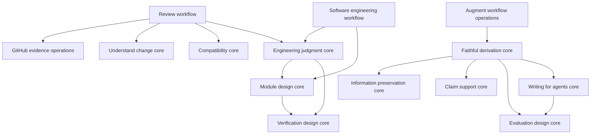

# Composable skill capabilities

Discussion proposal, 2026-09-08. Source baseline: `c9def15`.
Accepted design proposal. [Composable skills](composable-skills.md) describes the
implemented local architecture; this document preserves the worked examples and
reasons for the cut. Source links follow the methods to their current homes.

## Purpose

Make it possible to delegate a substantial outcome through one small skill
interface, or independently use the judgments beneath it. A skill earns depth
by taking responsibility away from its caller while preserving the information
the caller needs to judge its result. A large implementation or dependency count
does not establish depth.

The current library has useful methods and composition relationships. Its
[contract](historical-core-shell-contract.md) and
[architecture](core-shell.md) instead make every skill an operational entry
point paired with a private `core.md`. The proposed change is to make reusable
capabilities normal skill interfaces and design workflows around their actual
integration responsibilities. There is no required core/shell pair per package.

## Responsibility before packaging

Three roles help describe dependencies; they are not three mandatory layers:

- **Judgment and transformation:** apply a discipline to supplied context and
  return useful work, limitations, or a precise evidence/decision need. These
  are the functional core skills. They may compose other core skills.
- **Workflow:** own a delegated outcome, acquire context, choose relevant
  judgments, reconcile results, and execute and observe authorized effects.
  Workflows may use other bounded workflows as well as cores.
- **Acquisition and operations:** hide a platform's query, pagination,
  translation, mutation and receipt mechanics. These are useful operational
  modules, even when they support rather than own the user's whole task.

A core can produce prose, a proposed diff, a design, or a next probe. It can read
its method definitions and packaged domain knowledge. Task-specific live source
acquisition, file mutation, waiting and tool execution belong to the surrounding
workflow. This is a responsibility contract, not an enforced sandbox or a claim
of deterministic model behavior.

A workflow can retain private judgment tightly coupled to its own outcome.
Extract that judgment when another caller needs it independently; do not create
a corresponding public core merely for symmetry. References remain appropriate
for examples, rules, schemas and methods that need no separate invocation.

## The interface a caller learns

Each skill should make five things clear without forcing a universal schema:

| Contract | Caller knowledge |
| --- | --- |
| Responsibility | The question or outcome it takes over, including its stopping boundary |
| Inputs | Essential purpose, material and constraints; optional prior results it can reuse |
| Result | The usable assessment, transformation, artifact or observed outcome |
| Uncertainty | What remains supported, what could change it, and what is missing |
| Effects | Whether it reasons over inputs or owns scoped acquisition/execution |

For example, a compatibility core accepts exact versions, repository usage,
runtime constraints and upstream evidence. It returns affected behavior,
migration obligations and proof gaps. A caller does not need its internal
checklist. A review workflow accepts a target and review purpose; it owns
obtaining those compatibility inputs when that concern applies.

Direct use of a core remains natural: “Assess this upgrade using these records.”
For “Assess the upgrade in this repository,” the surrounding agent task owns
materializing the records and satisfying returned needs. A named workflow earns
its place when its investigation and integration method adds something beyond
that ordinary task orchestration. Do not manufacture an acquisition wrapper for
every independently callable judgment.

### Composition rules

1. Dependencies name the result needed and the condition for using it. Do not
   load all possible supporting skills at the start of every task.
2. A core may call another core; it returns acquisition needs to its operational
   caller. A workflow may delegate an entire bounded operational responsibility.
3. The nearest operational owner resolves obtainable needs. It returns supported
   partial work if access fails, instead of making its caller operate its internals
   or repeatedly asking for the same unavailable input.
4. Source identity, relevant revision/time/scope, and material uncertainty travel
   with results. Reuse supplied current context; refresh affected judgments when
   their premises change. A pointer alone is insufficient where content is needed.
5. Conflicting results retain their reasons. The composing owner determines
   whether the conflict is factual, a criteria mismatch, or an owner tradeoff.
   It obtains evidence or exposes the decision; it does not average verdicts.
6. Calling a support skill does not transfer the parent task or widen authority.
   “Review this” remains a review even when diagnosis or implementation methods
   contribute. “Fix this” retains the user's existing edit authority.
7. Static dependencies should not loop back into their callers. Repeated
   reasoning is a workflow's feedback loop over new observations, not mutual
   recursive invocation between skills.
8. Loading a skill does not imply spawning an agent. Independence is a separate
   requirement selected when the task needs independent evidence.

## Worked composition 1: review a change

**Small interface:** target plus intended outcome and any review constraints.
**Promise:** one supported assessment of request fit and codebase fit, findings
with consequences, checked coverage and meaningful residual uncertainty.

The review implementation owns target selection, investigation coverage,
supporting judgment selection, falsification and synthesis. A live publication
request adds current-target verification and publication/read-back; it is not
part of every review.

| Capability | Responsibility delegated by review | What review still owns |
| --- | --- | --- |
| GitHub evidence | Current comparison, discussion and CI observations with completeness limits | Which facts its judgment needs; whether checks establish the requested behavior |
| Understand change | Behavior/responsibility map from source, intent and receipts | Obtaining relevant source and ensuring the review covers the material change |
| Engineering judgment | Applicable code/contract obligations and candidate defects | Integrated severity and request fit |
| Dependency compatibility | Usage × upstream delta × runtime assessment | Acquiring missing records and integrating compatibility with other concerns |
| Interface design | Observed interaction/composition weaknesses | Obtaining renders and weighing user impact in the change |
| Causal reasoning | Assess supplied reproduction/probe evidence and choose a discriminating next observation | Execute a permitted probe or delegate a bounded diagnosis |
| Reviewability, when requested | Faithful reviewer-facing account from the map and judgment | Requested delivery and currentness of publication |

**Illustrative walkthrough, not a live PR review:** a library upgrade has green
unit tests, but its release changes browser packaging. Change understanding
identifies the container install path; compatibility identifies a runtime proof
gap; verification design says unit-test fakes cannot establish installed browser
availability. Review obtains a representative runtime observation if available
within scope. If unavailable, its conclusion preserves that exact limitation.
It does not call the upgrade safe because other judgments were favorable.

If the PR head changes during investigation, review refreshes affected evidence
and judgments. It retains still-valid observations instead of restarting every
supporting skill or publishing a stale verdict.

**Ad hoc reuse:** compatibility can assess a supplied version/usage packet with
no PR. Understand change can explain a non-code proposal without issuing a
verdict. Engineering judgment can assess a proposed parser before implementation.

**Depth test:** callers delegate the investigation and integration. They do not
assemble a checklist of specialists or reconcile their reports themselves.

## Worked composition 2: implement a selected change

**Small interface:** desired behavior or accepted design, target, constraints and
existing authorization. **Promise:** the requested behavior implemented coherently,
with evidence at the boundaries that own the claims and explicit remaining gaps.

Software engineering remains the operational owner. It examines the repository,
resolves relevant design questions, edits, runs checks and incorporates feedback.
An architecture scan, formal specification, test-first sequence, independent
review, merge or deployment is selected only when the task calls for it.

| Capability | Returned result | Integration owned by implementation |
| --- | --- | --- |
| Domain modeling, when meaning is unsettled | Terms, invariants, discriminating examples and unresolved choices | Obtain code/owner context; persist settled documentation when in scope |
| Engineering restraint, when adding machinery | Necessity, alternatives, ongoing cost and recommendation | Preserve the desired behavior and settled owner choices |
| Module design | Proposed ownership/interface, caller usage and tradeoffs | Fit the proposal to actual code and accepted scope |
| Engineering judgment | Correctness obligations or assessment of a candidate | Produce the implementation and address applicable obligations |
| Verification design | Observation seams, independent oracles and required runtime evidence | Construct/run checks and return their actual observations |
| Diagnosing bugs, for a material unexpected failure | Verified cause or bounded uncertainty and next need | Delegate the diagnostic loop without abandoning the implementation goal |

**Illustrative walkthrough:** implement cancellation of an in-flight operation.
Domain modeling distinguishes cancellation from ordinary failure. Module design
places lifetime ownership at the application operation and propagates cancellation
through the adapter. Engineering judgment checks cleanup and error handling;
verification design identifies a test of caller-visible cancellation plus the
real adapter observation needed for any platform claim. Implementation writes
and exercises the behavior. If a probe shows cleanup is late, that observation
feeds back into the owning lifetime design rather than adding a special-case flag.

The workflow resolves dependencies, not a fixed sequence: settled meaning needs
no modeling interview; an established module seam needs no alternatives exercise.
When restraint recommends smaller scope but a contract requires the larger
behavior, implementation exposes and resolves that conflict instead of silently
substituting the smaller result.

**Ad hoc reuse:** module design can assess two supplied interfaces; verification
design can explain why a passing test does not prove durability; engineering
judgment can supply implementation obligations without writing code.

**Depth test:** the user delegates a behavioral change. They need not sequence
design disciplines, run the edit/test loop, or translate diagnostic findings into
implementation steps.

## Worked composition 3: design an evidence-derived workflow

**Small interface:** the work product, audience/use moment, source setting and
constraints. **Promise:** a coherent derivation design whose output obligations,
judgments, representations, support, publication behavior and evaluation fit
together. Actual product changes belong to an operational caller.

Faithful derivation is a deep composite core. Its existing contract already owns
the relationships between these concerns; reducing it to a list of supporting
skills would lose the most valuable part. It can serve an ordinary design task,
tech-spec, a workflow review, or Augment workflow operations.

| Supporting core | Contribution | Faithful derivation's integration responsibility |
| --- | --- | --- |
| Information preservation | Consumer-specific fidelity contracts and loss assessment | Ensure each judgment's inputs survive upstream transformations |
| Claim support | Assessment of actual claims and sources; method for future support policy | Match supported assertiveness to the visible output and retain contradictions |
| Evaluation design | Cases, observations, oracles, ablations and decision rules | Cover final output and important intermediate judgments/edges |
| Writing for agents | Proposed instructions and invocation/context contracts | Keep prompts node-local; preserve graph-owned control and authority |

**Illustrative walkthrough:** design an account brief showing current commitments
and unresolved concerns. Fidelity analysis requires exact owners, dates and scope;
a generic summary cannot discard a later withdrawal. Claim support keeps the
withdrawal as counterevidence to an older commitment. Derivation design makes
publication use the current qualified conclusion and specifies invalidation when
the source changes. Evaluation includes superseded commitments and cross-account
lookalikes; an ablation removes chronology to test whether the design loses the
distinction it claims to preserve.

With a proposed workflow but no actual output, this returns support policy and
an evaluation plan, not fabricated claim assessments or measured quality.
An expert interview obtains missing quality judgments using the derivation
question bank and appropriate conversation mechanics. That domain question bank
stays with derivation; its meaning is not duplicated in a generic interviewing skill.

For a requested Augment implementation, augment-workflows supplies live node
contracts and canonical dependencies, consumes the derivation design, performs
the requested operations and returns real validation/execution observations.
Product constraints can force a revised derivation design. Structural acceptance
alone cannot settle fidelity or destination behavior.

**Ad hoc reuse:** a source-to-summary preservation assessment needs no workflow
graph; an evaluation plan needs no execution; faithful derivation itself can
design a non-Augment system from supplied context.

**Depth test:** the caller need not independently connect output obligations,
source fidelity, support, invalidation and evals. Those relationships are the
module's implementation.

## Proposed dependency shape

This is a selected design graph, not the current graph or a mandatory execution
sequence. “Core” labels denote supplied-context judgment; operational callers
own the feedback and acquisition loops omitted here for readability.

The shared cores do not depend on software-engineering or augment-workflows
entry points. A design reference may explain a workflow's constraints without
invoking that workflow. Dependencies must reach normal core skill interfaces,
not private file paths used as an alternative API.

## Whole-library disposition

These are proposed responsibilities, not instructions to rename everything.
All 29 current skills are accounted for. Four new core names below are working
names whose extraction is supported by existing consumers.

| Existing skill | Proposed ownership and treatment |
| --- | --- |
| architecture-scan | Keep the read-only investigation and ranking workflow; consume engineering and module judgment. Keep scan-specific ranking private. |
| augment-design | Make the brand system/application judgment the core interface, composing interface-design and humanize. Keep assets/tokens with it. Relocate actual build/render/audit execution into consuming artifact workflows or the surrounding task, preserving the QA obligations. |
| augment-workflows | Keep live product acquisition, operations and observation; consume faithful-derivation and writing-for-agents. |
| claim-support | Core support assessment; source-specific acquisition belongs to callers. |
| creative-ideation | Core method selection and supplied-material creative transformation; preserve all named methods and attribution. Caller executes interviews, random draws and physical/timed exercises. No method-per-skill explosion. |
| critique | Core falsification against supplied criteria and evidence. Independent dispatch and acceptance remain with callers. |
| decision-rights | Core standing and settlement judgment. Caller performs the resulting verification, question or next action. |
| dependency-compatibility | Core version/usage/runtime assessment, usable from review and upgrade planning; caller acquires evidence. |
| diagnosing-bugs | Keep reproduction, probes, instrumentation and authorized correction workflow; extract reusable causal-reasoning. |
| domain-modeling | Core language/invariant and qualifying-decision proposals; caller owns code discovery, conversation and glossary/ADR persistence. |
| engineering-restraint | Core necessity and ownership-cost judgment, composing decision-rights when standing is disputed. |
| evaluation-design | Core evaluation design for AI/instruction systems. Keep stochastic quality, calibration, layer evals and ablations together. |
| faithful-derivation | Deep composite core owning end-to-end derivation adequacy. Keep its DAG, promotion, publication and domain methods coherent. Callers own elicitation and execution. |
| github-evidence | Operational platform module. Keep pagination, currentness and receipt interpretation together; a separate receipt core lacks a strong independent need. |
| grafana-evidence | Operational telemetry module. Keep population-before-specimens, selector validation and evidence interpretation with acquisition; causal diagnosis remains separate. |
| grilling | Keep the selected conversational workflow and frontier update method together. Domain-specific question content can be supplied by other capabilities. |
| humanize | Core prose transformation with protected meaning and selected voice mode. Ordinary tasks own file reads/writes. |
| information-preservation | Core fidelity contracts and source-to-representation loss assessment. |
| interface-design | Deep design/assessment core with existing craft references; use experiment-design for unresolved questions. Caller owns rendering, prototyping and implementation. |
| module-design | Core ownership/interface judgment and comparison. Selected independent alternatives execution moves to a consuming design workflow; retain the comparison method here. |
| prototype | Operational experiment construction and observation, consuming experiment-design. Preserve throwaway/fidelity limits. |
| review | Keep investigation and integrated verdict workflow. Reuse supporting cores; keep outcome-specific synthesis local unless another caller establishes a separate need. |
| reviewability | Core faithful reviewer-facing transformation, composing understand-change and claim-support as needed. Caller owns source recovery and publication. |
| show-me | Keep explanation artifact delivery workflow, including construction/rendering when needed. Visual-form knowledge stays a readable reference for reviewability; no separate visual core skill yet. |
| software-engineering | Keep implementation, selected TDD, finishing and lint execution. Extract engineering-judgment and verification-design for shared use. |
| steward | Keep durable intent, coordination and acceptance workflow; consume critique and decision-rights. No public duplicate of its runtime-specific next-action judgment. |
| tech-spec | Keep source acquisition, decision resolution and typed specification delivery. Compose core design disciplines; retain complete contract-and-flow coverage as its distinctive method. |
| understand-change | Core source-to-behavior/responsibility map for review, explanation and writing. Caller owns source discovery. |
| writing-for-agents | Core instruction design/transformation and packaging knowledge; compose evaluation-design when needed. Caller owns stored edits and actual behavioral comparisons. |

### Four extractions with concrete consumers

| Working name | Small interface and hidden method | Source and consumers |
| --- | --- | --- |
| engineering-judgment | Given a semantic change and repository context, return implementation obligations or supported weaknesses. Hide applicability across values, boundaries, failures, effects and contracts. | [Engineering core](../../engineering-judgment/SKILL.md) and [standards](../../engineering-judgment/references/standards.md); review, implementation, scan, spec. |
| verification-design | Given a behavioral claim and system seam, return a proof strategy or assess supplied proof. Hide observation choice, independent oracles, production seams, substitute limits and regression preservation. | [Testing evidence](../../verification-design/SKILL.md); module-design, engineering judgment, diagnosis, review, spec. |
| causal-reasoning | Given symptom/context and actual loop/probe receipts, return reproduction adequacy, ranked hypotheses, next discriminating probe or supported cause. Preserve the existing reproduction gate. | [Diagnosis core](../../causal-reasoning/SKILL.md); diagnosing-bugs and review of causal claims. |
| experiment-design | Given an unresolved question and constraints, return the smallest discriminating experiment; given results, return learning and limits. | [Prototype core](../../experiment-design/SKILL.md); prototype and interface-design. |

Verification design and evaluation design share concern for evidence, but their
distinctive implementations differ. Keep software boundary/oracle/runtime proof
with verification; keep representative AI quality, calibrated judgments and
ablations with evaluation. They can exchange a needed proof obligation without
both owning the same method. Do not add a universal evidence parent solely to
make the taxonomy symmetrical.

## Why this cut

Merely promoting all 29 core files and retaining 29 wrappers would expose both
halves of every old package, regardless of independent usefulness. Flattening
everything into core skills would make the caller own diagnosis, review and
implementation choreography. Retaining only large workflows would duplicate
their shared judgment and prevent useful ad hoc calls.

The recommended cut keeps deep workflows, exposes independently valuable cores,
and leaves coupled methods private. It adds four justified skill interfaces,
subject to the walkthrough checks below; package count is not an acceptance goal.

Two boundaries deserve particular attention before migration:

- Augment design's mandatory build/render/audit obligations must remain reliably
  selected by every relevant artifact caller. If ordinary task composition fails
  to preserve them, a named branded-artifact workflow earns an interface.
- Ad hoc requests with source paths must still acquire evidence without exposing
  an input-assembly burden to the user. If the host repeatedly stalls at a core's
  missing inputs, repair the caller contract; add a dedicated workflow only when
  it owns a distinct investigation method.

## Migration and evidence

After agreement on the responsibilities, migrate a complete consumer/provider
slice at a time. Preserve original methods and their depth, not only summaries.

1. Establish engineering-judgment and verification-design with their existing
   methods; migrate review and implementation plus all existing reference callers.
   This tests the same capability under assessment and execution.
2. Promote understand-change, compatibility and module-design to their core
   interfaces; update scan/spec and selected alternatives execution ownership.
3. Migrate faithful-derivation and its supporting cores together with its
   Augment operational caller and expert-elicitation paths.
4. Migrate diagnosis/experiment boundaries and remaining writing, design,
   creative and stewardship consumers using the disposition above.
5. Replace the active architecture contract, README and invocation expectations.
   Remove obsolete paired-core indirection once callers have moved. Preserve
   historical architecture documents as historical. Check packaging separately.

For each slice, inventory moved rules, examples, exclusions, attribution,
operational branches and all callers before editing. Validate links/metadata and
existing affected tests. Preserve host discovery triggers and explicit-only scan
and spec behavior. Do not introduce a scheduler, universal result JSON, dependency
injection framework or semantic linter to enforce this instruction architecture.

The following are proposed behavioral probes, not executed validation:

| Probe | Observation required |
| --- | --- |
| Same compatibility inputs under review and standalone use | Equivalent supported assessment and gaps; no private-path knowledge required |
| Core supplied only a source pointer | Specific missing-content need, no invented source access or result |
| Workflow receives that need | Acquires available content and resumes; does not ask user to do obtainable research |
| Review head changes | Refreshes affected conclusions; no old-head publication claim |
| Green fake test for a persistence claim | Names missing real-storage evidence rather than declaring durable behavior proved |
| Approved simple implementation | Relevant judgments apply without forcing scan/spec/TDD/Steward |
| Derivation design has no output or measurements | Produces policy and eval plan; no observed-quality assertion |
| Old commitment followed by withdrawal | Chronology and contradiction survive preservation, support and final rendering policy |
| Existing owner tradeoff conflicts with a preference | Composing workflow preserves settlement and continues within authority |
| Brand task moves to core composition | Required assets, voice and actual render/audit checks remain reached |

Compare baseline and candidate runs on matching inputs and meaningful exclusions.
Inspect tool behavior, caller burden, information loss and actual output, not just
whether the expected skill name appeared. A link check proves reachability of a
path, not correct invocation, useful depth or improved results.

## Evidence and limits of this proposal

The design is grounded in the 29 current entry/core pairs, their cross-skill
links, selected branch and reference methods, architecture history and invocation
checks. Existing dependency evidence includes review's supporting assessments,
the shared testing reference, interface-design's prototype-core call and faithful
derivation's preservation/support/evaluation composition.

The worked examples are analytical walkthroughs. No live PR, product workflow,
host-routing experiment, model evaluation or deployment was performed for them.
This is a concrete candidate architecture for discussion, not an empirically
validated replacement or an exhaustive re-review of every retained reference.
