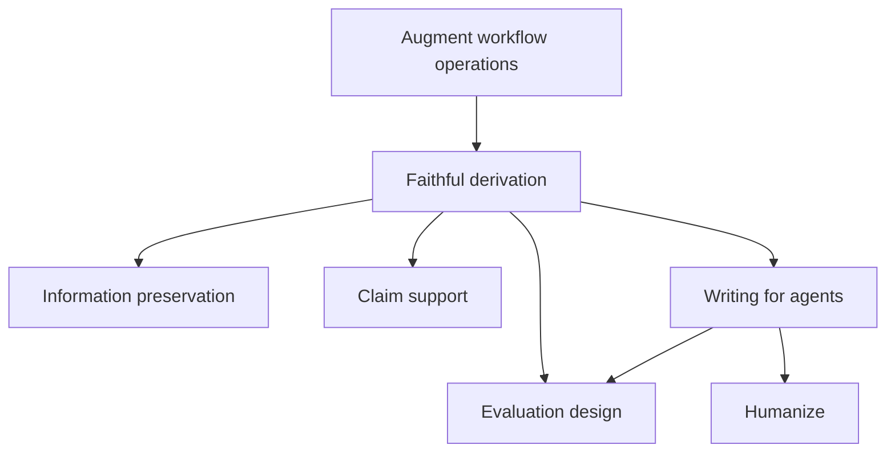

# Composable skills

A skill is a module: its caller delegates a responsibility through a small
interface, and its implementation hides the method needed to fulfill it.
`SKILL.md` is the public interface for direct use and composition. References
hold the examples, criteria, schemas and selected methods that give the module
depth. A caller should not need private implementation paths to use its judgment.

The library contains 21 core skills and 12 operational skills. These roles
place responsibility for effects; they do not impose a fixed hierarchy. Core
skills may compose cores, and workflows may delegate bounded operational work.
The [composition contract](../../contracts/composition.md) governs those calls.

## What each caller owns

A core takes supplied purpose, material, evidence and constraints. It returns a
judgment, transformation, design or precise missing-input need. It can read its
methods and packaged knowledge. Live source acquisition, execution and waiting
belong to its operational caller.

A workflow owns an outcome: it selects relevant supporting capabilities, obtains
their inputs, reconciles results and continues through authorized effects and
observations. The nearest operational owner resolves a missing source instead
of making its caller manage the investigation's internal steps.

For ad hoc core use, the surrounding agent task is that operational owner. It
reads a supplied path or URL, provides context, and carries the result through
the user's requested action. A supplied-only request stays within supplied evidence.
A new workflow is useful when its method of investigation or coordination earns
an independent interface; ordinary file I/O does not require another skill.

## Review and implementation share judgment

| Responsibility | Owner | Callers |
| --- | --- | --- |
| Explain the semantic change | understand-change | review, reviewability, show-me, ad hoc explanation |
| Assess code and contract obligations | engineering-judgment | review, software-engineering, architecture-scan, tech-spec |
| Place ownership and design interfaces | module-design | engineering-judgment, software-engineering, architecture-scan, tech-spec |
| Design proof or assess its strength | verification-design | engineering-judgment, module-design, review, software-engineering, diagnosing-bugs, tech-spec |
| Assess a version change against usage and runtime | dependency-compatibility | review, ad hoc upgrade planning |
| Interpret reproduction and probes | causal-reasoning | diagnosing-bugs, review |

Review owns the current comparison, investigation coverage, falsification and
integrated verdict. Implementation owns repository changes, selected execution
methods and observed behavior. Both can use the same verification judgment without
starting each other's workflow.

For an upgrade review, compatibility may identify a browser-packaging risk and
verification may explain why mocked tests cannot prove installed browser behavior.
Review acquires the missing runtime observation or returns the exact gap. A changed
head refreshes affected conclusions; it does not turn old green checks into new
proof or require discarding unrelated evidence.

For an implementation, an unexpected failure can be delegated to diagnosis with
the current symptom, observations and fix authority. Diagnosis owns the loop;
implementation consumes the result and continues toward the requested behavior.
A formal scan, spec or test-first method is selected only when the task reaches it.

## Faithful derivation is a composite core

Edges are selected by the question. Actual claim assessment requires claims and
sources; future support policy uses the owned support method. An evaluation plan
can be designed before a workflow runs, but cannot establish observed quality.

Faithful derivation owns how output obligations, judgment inputs, fidelity,
support, invalidation, publication policy and evals fit together. If a representation
cannot carry the evidence a publication decision needs, that is a design conflict
to resolve within derivation, not two independent reports to hand to the caller.
Its domain question bank and handoff requirements stay with that method. The
operational caller asks the questions, implements the design and returns actual
observations for assessment.

Augment workflows supplies current product contracts, canonical dependencies,
operations and execution receipts. Faithful derivation also works independently
on a supplied non-Augment design; its core has no product acquisition dependency.

## Design, experiments and visible artifacts

Interface design returns a direction or assessment from the moment, constraints
and actual surface evidence. Experiment design can propose the smallest probe
of an unresolved interaction or state question. Prototype builds and exercises
that experiment, then returns observations for interpretation.

Show-me owns a visible explanation of an established relationship. Its visual-form
reference also supports reviewability's proposed diagrams without requiring a
rendering workflow for every written account. Interactivity alone does not make
an explanation an experiment.

Augment design owns the packaged identity, composition, voice and branch floors.
It composes interface design and humanize, and returns the required production
checks with a surface design or assessment. Software engineering, prototype,
show-me or the surrounding artifact task performs those checks. The caller must
supply renders and audit observations before claiming the surface meets its floor.
A brand resource or copy-only request does not require constructing a surface.

## What stays together

- Review's verdict synthesis and scan's ranking belong to their outcomes. They
  do not need public core counterparts solely because they contain judgment.
- GitHub pagination/currentness and Grafana population/selector interpretation
  remain with acquisition. Callers receive facts with scope and limits.
- Grilling owns its evolving frontier and conversation rounds. Domain-specific
  questions can come from another capability without duplicating that domain's method.
- Steward owns durable state, actor coordination and acceptance. Critique returns
  findings; decision-rights returns standing and settlement. Neither opens runtime.
- Creative ideation keeps its named methods, distinctions, examples and attribution
  behind one invocation. The caller performs external exercises and supplies observations.
- Verification design owns software boundary and oracle proof; evaluation design
  owns representative AI quality, calibration, layer checks and ablations. Their
  different methods remain independently reachable.

## File and caller migration

| Former location | Current owner |
| --- | --- |
| A reusable skill's `core.md` | That skill's `SKILL.md` |
| software-engineering/core.md and references/standards.md | engineering-judgment |
| software-engineering/references/testing-evidence.md | verification-design |
| diagnosing-bugs/core.md | causal-reasoning |
| prototype/core.md | experiment-design |
| module-design/branches/alternatives.md | tech-spec/branches/design-alternatives.md, available to selected design callers |
| augment-design/operations.md | augment-design/references/production-checks.md, obligations for the operational caller |
| Workflow-specific core files | Integrated into the owning workflow or its existing method reference |

The four new skills expose methods already consumed across the library. Supporting
calls name their result and trigger through the public skill interface. Private
references remain valid for vocabulary, visual forms and other passive knowledge.

The [accepted proposal](composable-capabilities-proposal.md) records the complete
29-skill disposition and three analytical walkthroughs. The
[paired-file design](core-shell.md) and its
[contract](historical-core-shell-contract.md) remain historical. They do not govern
current invocation.

## Earlier invocation names

Older names remain discoverable through these owners; there are no alias packages.

| Earlier name or method | Current home |
| --- | --- |
| github-evidence | github |
| grafana-evidence | grafana |
| coding-standards | engineering-judgment |
| tdd, simplify | software-engineering: selected test-first work and finishing |
| codebase-design | module-design |
| write-custom-lint | software-engineering: lint enforcement |
| improve-codebase-architecture | architecture-scan |
| architecture spec branch | tech-spec |
| code-review | review |
| review artifact branch | reviewability |
| designing-human-interfaces | interface-design |
| show-me experiment branches | prototype, with experiment-design for supplied-context planning |
| review reconstruction method | understand-change |
| review dependency-bump lens | dependency-compatibility |
| faithful derivation fidelity/support/evaluation methods | information-preservation, claim-support, evaluation-design |
| Steward general falsification | critique; phase acceptance stays with Steward |
| steward immediate branch | decision-rights |
| creative-shaping | creative-ideation's named methods |

Herdr and Simplified Technical English remain retired at the owner's request.

## Evidence for the architecture

A useful boundary must work in a complete workflow and in ad hoc use. Verification
therefore checks source preservation and caller migration as well as metadata and
links. Behavioral probes must look for actual acquisition, effect boundaries,
information loss and caller burden, not only the presence of a skill name.

The [verification record](composable-skills-verification.md) identifies what was
checked and what remains unmeasured. Installed discovery and publication are
separate from a coherent local library.
