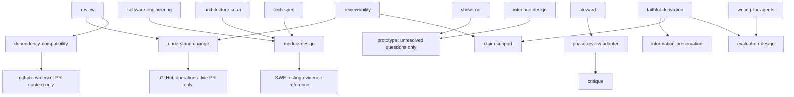

# Independently useful skill modules

This pass starts from b8bc170. It replaces the current topology described in
[the first module pass](skill-modules.md). The library now has 30 invocations.
The goal is independently usable judgment with less caller knowledge, not a
particular package count.

## Interfaces and ownership

| Module | Caller supplies | Module returns | Existing consumers |
| --- | --- | --- | --- |
| understand-change | Source, prior state, consumer question | Grounded change map with evidence and gaps | review, reviewability |
| module-design | Problem, callers, constraints and dependencies | Interface, ownership, hidden responsibilities, usage and tradeoffs | SWE, architecture-scan, tech-spec |
| dependency-compatibility | Component/version delta and target repository | Affected usage, migrations, compatibility evidence and proof gaps | review; directly selected upgrade planning |
| prototype | Unresolved question, constraints and distinguishing observation | Runnable experiment, observed answer, limits | show-me, interface-design |
| critique | Purpose, constraints, candidate, evidence and axes | Falsified weaknesses, covered scope, assessment | Steward's phase-review adapter |
| information-preservation | Source/transformation and consumer judgments | Fidelity contract or concrete loss assessment | faithful derivation; direct handoff/summary assessment |
| claim-support | Claims, sources, scope and consequence | Support, contradictions, justified wording and gaps | faithful derivation, reviewability |
| evaluation-design | Intended quality, system/change, failure consequences | Cases, oracles, layer checks, ablations and decision rules | faithful derivation, writing-for-agents |

The first four are primarily extractions of established methods. The last four
also need interface design: separating a reusable result from mission machinery,
turning evaluation dimensions into a concrete plan, and distinguishing a future
support/preservation policy from an assessment of actual data.

## Dependency graph

This is the changed dependency surface, not every dependency in the library.
Edges are conditional. A package-level arrow does not imply that every file or
workflow in that package is loaded. Module design consumes testing law directly;
it does not invoke SWE and recursively start implementation.

## What remains inside an owner

- Design alternatives and dependency-seam classification remain inside module
  design. Their vocabulary and comparison criteria are specific to that judgment.
- Finishing, selected TDD and lint enforcement remain inside SWE. No generic
  design-alternatives or universal testing router was introduced.
- Claim support owns its evidence/confidence reference; preservation owns its
  dimension/fidelity reference; evaluation design owns its evaluation library.
- Faithful derivation retains raw-state semantics, judgment DAGs, persistence and
  promotion, publication gates, domain glossary and work-product acceptance.
- Steward retains Intent/State/Record, phase axes, review schema, independence,
  scheduling, runtime and acceptance. Critique never writes the Record.
- Brand composition, platform floors, GritQL syntax, strict prose style and skill
  packaging remain references with their existing owners.
- The creative pair is unchanged.

## Call versus read

An actual support assessment needs claims and sources. Designing a future support
mechanism needs its method, not fabricated current claims. Faithful derivation's
design/interview/handoff guides therefore read the supporting owners' references;
concrete review work invokes their assessment interfaces. Evaluation design can
accept a proposed system and returns a plan, never a claim of observed quality.

Likewise, a caller can read module-design vocabulary without selecting its
parallel alternatives branch. A proposed result can receive critique without
opening Steward. A prototype answers uncertainty; an interactive explanation of
a known algorithm does not inherit prototype shortcuts.

## Preservation and verification

Moved source methods retain their unique examples and constraints. The three
faithful-derivation reference libraries and three prototype branch/contract files
move byte-for-byte. Other extracted methods change their interfaces and relative
links while retaining the domain method. Historical audit documents remain
historical; the active faithful-derivation coverage ledger follows the new homes.

The invocation corpus includes standalone positive cases, neighboring exclusions,
parent/support composition and design-time versus observed-evidence boundaries.
Structural validation checks metadata and links; its success does not demonstrate
model routing accuracy, evaluation results or an installed catalog reload.

Observed local checks: 30 skill contracts and 55 routing cases validate; the
validator's 4 regression tests pass with 19 assertions. An independent source
review found two interface defects (review-only assumptions in change
understanding; assessment invocation during future-policy design). Both were
corrected and the focused rereview returned no remaining actionable findings.
No model-routing experiments, installed reload or publication is claimed.
