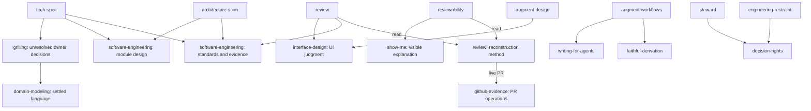

# Skill modules and dependency design

Historical first pass (b8bc170). [The extraction pass](extracted-modules.md)
supersedes this topology; retain these decisions as their original context.

The interface is the request that selects a judgment and the result its caller
can use. Depth comes from hiding a coherent method behind that interface, not
from collecting related topics under a broad name.

This design supersedes the package topology in `docs/intent-audit/`. That audit
remains the historical preservation record for commit 544a8b1.

## Decisions

| Interface | Responsibility | Change |
| --- | --- | --- |
| review | Findings and a supported code judgment | Separate review writing from the invocation. |
| reviewability | A faithful account that lets another person judge work | Restore independent invocation; consume one reconstruction method. |
| architecture-scan | Ranked, evidenced ownership moves | Split discovery from specification; explicit selection only. |
| tech-spec | Typed contracts and complete affected flows | Independent explicit selection; no scan prerequisite. |
| software-engineering | Correctness and comprehensibility of software | Absorb custom lint as selected enforcement, retaining full method and fixtures guidance. |
| interface-design | A coherent human experience, including state and time | Rename the existing discipline; preserve its depth. |
| decision-rights | Supported next action and settlement for an objection | Keep an independent trigger so it remains reachable before other disciplines load. |
| steward | Intent and proof that survive changing work | Separate immediate decision rights from durable coordination. |

Keep domain modeling, grilling and restraint independently reachable. They select
meaning, a questioning mode and a necessity/cost judgment respectively. Keep
human voice separate from agent instruction design; platform evidence separate
from judgments that consume it. Preserve the creative packages as requested.

## Three kinds of edge

- **Read:** consume a reference and return its result to the current task. Reading
  does not invoke the owning skill or transfer workflow control.
- **Use:** apply another discipline to a named subproblem; its result supports
  the caller. The caller retains responsibility for the overall outcome.
- **Handoff:** start another workflow only when selected by the user or already
  authorized by the task. A recommendation does not create that authority.

References live within a concrete owning package. No generic core/router or
always-loaded dependency manifest is needed. Read shared files directly; do not
load an owner's SKILL.md merely to reach a reference. Cross-package consumers
require the named package to be available; this repository is not a claim that
single-package distribution bundles its dependencies.

## Principal dependency paths

Edges are conditional on the governed concern. Shared methods have no edge back
to the caller's workflow. General interface craft does not load a specific brand;
Augment work composes the brand owner with interface craft. Scan-to-spec and
review-to-writing are requested follow-ups, not mandatory dependencies.

## Acceptance

Each entry point names one usable result. Required methods have explicit pointers
before their governed decision. Shared reconstruction and PR operations each
have one authoritative implementation; decision rights has one independently
discoverable owner. Routing examples distinguish
reading a method from invoking its owner, test adjacent exclusions, and retain
non-code review writing and non-TypeScript clarity. Metadata and links validate;
creative content and stewardship runtime remain unchanged. No installation or
publication is part of this repository change.

## Why decision rights remains an invocation

A reference-only home for decision rights would lose its observable trigger when
no containing discipline had loaded. Retain `decision-rights` as a deep judgment
module: disputed action and evidence enter; a next action and settlement leave.
Its six standing classes, fact resolution and challenge-and-commit method stay
behind that interface. Steward consumes the settlement without owning this
invocation. The final count is 22 entry points; count is not the design target.

## Local verification

- `ruby scripts/validate-skills.rb`: 22 skill contracts and 43 routing cases pass.
- `ruby tests/validate-skills_test.rb`: 4 tests, 19 assertions pass.
- Eight relocated resource files retain their exact bytes: interface references,
  scan/spec output contracts, and lint engine/fix guidance.
- Creative packages, stewardship runtime/tests/rules, and faithful derivation
  are unchanged from 544a8b1.
- The catalog and this document's file links resolve.
- An independent source review of the changed invocation/dependency seams found
  no actionable findings against 544a8b1. Its scope covered reachability, workflow
  activation, ownership and preservation; it did not execute host routing.

Routing cases state expected selection, including dependencies that must not
activate workflows. These structural checks are not empirical model-routing
results or an installed catalog reload.
