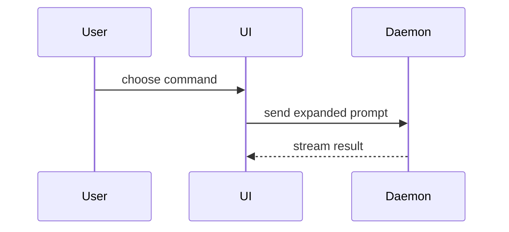

# Pull request description

The artifact supports a merge decision about the **current base-to-head change**.
Existing descriptions, commits, tickets and explanations provide intent; they
do not override the implemented change. Read [the change-account method](change-account.md),
obtain current source and actual validation, and pin the base/head comparison. For a local draft, use the pinned
local comparison and retain the lack of live PR evidence. If a required source
version cannot be obtained, state the exact evidence limit. Writing the description does not request a merge verdict.

## Specialize the map

Use the merge decision, live branch, intended post-merge behavior, semantic
base-to-head delta, meaningful implementation responsibilities, actual tests and
measurements, and unresolved risks as the review map. Account for every material
branch region before composing. Full private coverage does not require a long
public description.

Describe the final aggregate change as a reviewer of the eventual squash commit
would see it. Earlier attempts and temporary compatibility paths matter only when
they explain a surviving tradeoff.

## Match shape and evidence to the change

Include a section only when it answers a distinct reviewer question: purpose,
public interface, behavior delta, implementation responsibilities, rationale,
migration/rollout, reversibility, affected consumers, diff shape, validation,
visual evidence, or review focus.
These are choices, not a required outline.

A focused fix may need only purpose, mechanism, and evidence:

> Empty search results now clear the previous selection. The selection resets
> when results change; the existing empty-result regression passes.

Use that form only when the described behavior and test result were observed.
A broad change may need a responsibility map and explicit review focus.

For visual changes, include available labeled before/after captures with comparable viewport
and state. Use a diagram or small code sketch when the important relationship is
not visible in a screenshot. State a missing capture as a gap.

For performance claims, use a compact before/after table with metric, workload,
environment, and relevant spread or sample count. A complexity argument does not
substitute for a measured benchmark. Keep meaningful validation and uncertainty
in short descriptions; include exact commands and measurements when they help
reproduce or evaluate a claim.

When reversibility affects the merge or rollout decision, explain whether the
change is reversible and what rollback would require. A code revert
may not reverse stored data or external effects. When a shared contract or behavior
changes, identify the affected consumers and scope so reviewers can assess their
compatibility and the reach of the change.

## Choose the smallest useful view

Use a visual or code sketch when it clarifies the material relationship or delta.
Simple changes can remain prose. Place each view next to the short explanation it
supports, keeping only the calls, files, props, states and boundaries needed for
the reviewer’s question. Use one or several forms as needed; this menu is not a
required template. The examples teach forms, not evidence of a particular PR;
their content must match the pinned change when used in a description.

### Logic: pseudocode

Show a decision or algorithm without incidental syntax. For a save path that
reuses unchanged content:

```text
on(save)
  if content is unchanged
    return cached result
  write new content
  return fresh result
```

### Runtime order: call tree

Show which operation calls which, with siblings ordered as they execute. Mark
concurrent or deferred work explicitly when it matters; indentation alone does
not establish asynchronous completion. For a session submission:

```text
submitForm
  createSession
    persistPrompt
    launchAgent
  navigateToSession
```

### UI structure and state: component tree

Show the relevant component nesting, state source and module boundaries. For a
session page with a shared toolbar control:

```text
<SessionPage> (apps/example/src/routes/session.tsx)
  useSessionEvents() -> status, events
  <SessionToolbar status={status}>
    <RunSkillButton> (packages/ui)
  <SessionTimeline events={events}>
```

### Responsibility: shallow file tree

Show where meaningful responsibilities live, keeping the tree shallow. For a
refactor that separates command handling, session state and API transport:

```text
src/
├── commands/       # parses user actions
├── sessions/       # owns session state
└── transport/      # sends API requests
```

### Interaction or data flow: Mermaid

Show exchanges across components when a nested tree would hide their interaction.
For a command that returns a streamed result:



### Before/after delta: diff sketch

Use a diff when the surrounding shape already exists and the additions or removals
are the point. Match its shape to the question, using code, pseudocode, component,
file or call trees. Label a simplified sketch so it is not mistaken for the exact
source diff. For a toolbar addition:

```diff
 <SessionPage>
   <SessionToolbar>
+    <RunSkillButton />
   <SessionTimeline>
```

For a changed save decision, a pseudocode diff makes the new condition visible:

```diff
 on(save)
-  write content
+  if content is unchanged
+    return cached result
+  write new content
+  invalidate cache
```

Show the whole block when most of it is new, when omitted context would hide
ownership or order, or when a copyable target shape matters. For a new command
expander whose complete function is the useful view:

```ts
function expandSkill(command: string): string {
  const skillName = command.slice(1);
  return `use the ${skillName} skill`;
}
```

## Final read

Lead with the outcome and the condition that most affects how to understand it.
Use stable concepts from the map, not a tour of files or commits. Compare the draft
with the current base/head receipts: facts, measurements, scope, and checks
must still match; old prose must not describe an earlier branch state; follow-ups
must not appear completed.

The description is ready when a reviewer can state the behavioral delta, navigate
important responsibilities, assess evidence, and see where judgment is needed.
Publish only within the task's authority. If publication is requested, read the stored description back and verify it still matches the pinned change.
